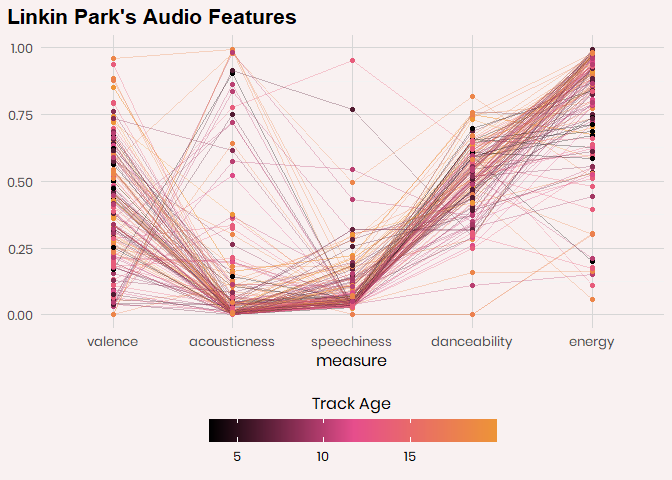
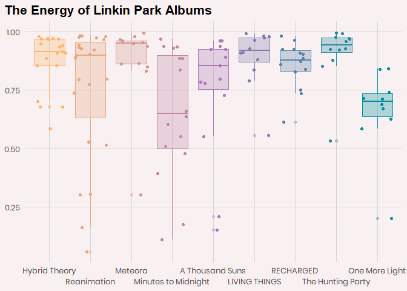

Introducing {linkinpark}
================

With the 20th anniversary of Hybrid Theory by Linkin Park coming this
month, I decided to put together a data package that contains a few
different datasets about the band.

## What’s Inside

### Data

#### Albums Charted By Billboard

This is a relatively small data set containing data about peak positions
on The Billboard Hard Rock Chart. This data includes the album name,
peak position reached, the date it peaked and the number of weeks the
album charted.

``` r
billboard_albums %>% 
  head() %>%
  gt() %>%
  table_style_lp() %>%
  tab_source_note("Data: Billboard.com" ) %>%
  tab_header(md("**Billboard Albums**"))
```

<!--html_preserve-->

<style>html {
  font-family: -apple-system, BlinkMacSystemFont, 'Segoe UI', Roboto, Oxygen, Ubuntu, Cantarell, 'Helvetica Neue', 'Fira Sans', 'Droid Sans', Arial, sans-serif;
}

#iutmqtnwqc .gt_table {
  display: table;
  border-collapse: collapse;
  margin-left: 20px;
  margin-right: auto;
  color: #333333;
  font-size: 16px;
  font-weight: normal;
  font-style: normal;
  background-color: #FFFFFF;
  width: auto;
  border-top-style: solid;
  border-top-width: 2px;
  border-top-color: white;
  border-right-style: none;
  border-right-width: 2px;
  border-right-color: #D3D3D3;
  border-bottom-style: solid;
  border-bottom-width: 3px;
  border-bottom-color: white;
  border-left-style: none;
  border-left-width: 2px;
  border-left-color: #D3D3D3;
}

#iutmqtnwqc .gt_heading {
  background-color: #FFFFFF;
  text-align: left;
  border-bottom-color: #FFFFFF;
  border-left-style: none;
  border-left-width: 1px;
  border-left-color: #D3D3D3;
  border-right-style: none;
  border-right-width: 1px;
  border-right-color: #D3D3D3;
}

#iutmqtnwqc .gt_title {
  color: #333333;
  font-size: 125%;
  font-weight: initial;
  padding-top: 4px;
  padding-bottom: 4px;
  border-bottom-color: #FFFFFF;
  border-bottom-width: 0;
}

#iutmqtnwqc .gt_subtitle {
  color: #333333;
  font-size: 85%;
  font-weight: initial;
  padding-top: 0;
  padding-bottom: 4px;
  border-top-color: #FFFFFF;
  border-top-width: 0;
}

#iutmqtnwqc .gt_bottom_border {
  border-bottom-style: solid;
  border-bottom-width: 2px;
  border-bottom-color: #D3D3D3;
}

#iutmqtnwqc .gt_col_headings {
  border-top-style: solid;
  border-top-width: 3px;
  border-top-color: white;
  border-bottom-style: solid;
  border-bottom-width: 2px;
  border-bottom-color: #90998A;
  border-left-style: none;
  border-left-width: 1px;
  border-left-color: #D3D3D3;
  border-right-style: none;
  border-right-width: 1px;
  border-right-color: #D3D3D3;
}

#iutmqtnwqc .gt_col_heading {
  color: #333333;
  background-color: #FFFFFF;
  font-size: 100%;
  font-weight: normal;
  text-transform: inherit;
  border-left-style: none;
  border-left-width: 1px;
  border-left-color: #D3D3D3;
  border-right-style: none;
  border-right-width: 1px;
  border-right-color: #D3D3D3;
  vertical-align: bottom;
  padding-top: 5px;
  padding-bottom: 6px;
  padding-left: 5px;
  padding-right: 5px;
  overflow-x: hidden;
}

#iutmqtnwqc .gt_column_spanner_outer {
  color: #333333;
  background-color: #FFFFFF;
  font-size: 100%;
  font-weight: normal;
  text-transform: inherit;
  padding-top: 0;
  padding-bottom: 0;
  padding-left: 4px;
  padding-right: 4px;
}

#iutmqtnwqc .gt_column_spanner_outer:first-child {
  padding-left: 0;
}

#iutmqtnwqc .gt_column_spanner_outer:last-child {
  padding-right: 0;
}

#iutmqtnwqc .gt_column_spanner {
  border-bottom-style: solid;
  border-bottom-width: 2px;
  border-bottom-color: #90998A;
  vertical-align: bottom;
  padding-top: 5px;
  padding-bottom: 6px;
  overflow-x: hidden;
  display: inline-block;
  width: 100%;
}

#iutmqtnwqc .gt_group_heading {
  padding: 8px;
  color: #333333;
  background-color: #FFFFFF;
  font-size: 100%;
  font-weight: initial;
  text-transform: inherit;
  border-top-style: solid;
  border-top-width: 2px;
  border-top-color: #D3D3D3;
  border-bottom-style: solid;
  border-bottom-width: 2px;
  border-bottom-color: #D3D3D3;
  border-left-style: none;
  border-left-width: 1px;
  border-left-color: #D3D3D3;
  border-right-style: none;
  border-right-width: 1px;
  border-right-color: #D3D3D3;
  vertical-align: middle;
}

#iutmqtnwqc .gt_empty_group_heading {
  padding: 0.5px;
  color: #333333;
  background-color: #FFFFFF;
  font-size: 100%;
  font-weight: initial;
  border-top-style: solid;
  border-top-width: 2px;
  border-top-color: #D3D3D3;
  border-bottom-style: solid;
  border-bottom-width: 2px;
  border-bottom-color: #D3D3D3;
  vertical-align: middle;
}

#iutmqtnwqc .gt_from_md > :first-child {
  margin-top: 0;
}

#iutmqtnwqc .gt_from_md > :last-child {
  margin-bottom: 0;
}

#iutmqtnwqc .gt_row {
  padding-top: 8px;
  padding-bottom: 8px;
  padding-left: 5px;
  padding-right: 5px;
  margin: 10px;
  border-top-style: solid;
  border-top-width: 1px;
  border-top-color: white;
  border-left-style: none;
  border-left-width: 1px;
  border-left-color: #D3D3D3;
  border-right-style: none;
  border-right-width: 1px;
  border-right-color: #D3D3D3;
  vertical-align: middle;
  overflow-x: hidden;
}

#iutmqtnwqc .gt_stub {
  color: #333333;
  background-color: #FFFFFF;
  font-size: 100%;
  font-weight: initial;
  text-transform: inherit;
  border-right-style: solid;
  border-right-width: 2px;
  border-right-color: #D3D3D3;
  padding-left: 12px;
}

#iutmqtnwqc .gt_summary_row {
  color: #333333;
  background-color: #FFFFFF;
  text-transform: inherit;
  padding-top: 8px;
  padding-bottom: 8px;
  padding-left: 5px;
  padding-right: 5px;
}

#iutmqtnwqc .gt_first_summary_row {
  padding-top: 8px;
  padding-bottom: 8px;
  padding-left: 5px;
  padding-right: 5px;
  border-top-style: solid;
  border-top-width: 2px;
  border-top-color: #D3D3D3;
}

#iutmqtnwqc .gt_grand_summary_row {
  color: #333333;
  background-color: #FFFFFF;
  text-transform: inherit;
  padding-top: 8px;
  padding-bottom: 8px;
  padding-left: 5px;
  padding-right: 5px;
}

#iutmqtnwqc .gt_first_grand_summary_row {
  padding-top: 8px;
  padding-bottom: 8px;
  padding-left: 5px;
  padding-right: 5px;
  border-top-style: double;
  border-top-width: 6px;
  border-top-color: #D3D3D3;
}

#iutmqtnwqc .gt_striped {
  background-color: rgba(128, 128, 128, 0.05);
}

#iutmqtnwqc .gt_table_body {
  border-top-style: solid;
  border-top-width: 2px;
  border-top-color: #D3D3D3;
  border-bottom-style: solid;
  border-bottom-width: 2px;
  border-bottom-color: #D3D3D3;
}

#iutmqtnwqc .gt_footnotes {
  color: #333333;
  background-color: #FFFFFF;
  border-bottom-style: none;
  border-bottom-width: 2px;
  border-bottom-color: #D3D3D3;
  border-left-style: none;
  border-left-width: 2px;
  border-left-color: #D3D3D3;
  border-right-style: none;
  border-right-width: 2px;
  border-right-color: #D3D3D3;
}

#iutmqtnwqc .gt_footnote {
  margin: 0px;
  font-size: 90%;
  padding: 4px;
}

#iutmqtnwqc .gt_sourcenotes {
  color: #333333;
  background-color: #FFFFFF;
  border-bottom-style: none;
  border-bottom-width: 2px;
  border-bottom-color: #D3D3D3;
  border-left-style: none;
  border-left-width: 2px;
  border-left-color: #D3D3D3;
  border-right-style: none;
  border-right-width: 2px;
  border-right-color: #D3D3D3;
}

#iutmqtnwqc .gt_sourcenote {
  font-size: 90%;
  padding: 4px;
}

#iutmqtnwqc .gt_left {
  text-align: left;
}

#iutmqtnwqc .gt_center {
  text-align: center;
}

#iutmqtnwqc .gt_right {
  text-align: right;
  font-variant-numeric: tabular-nums;
}

#iutmqtnwqc .gt_font_normal {
  font-weight: normal;
}

#iutmqtnwqc .gt_font_bold {
  font-weight: bold;
}

#iutmqtnwqc .gt_font_italic {
  font-style: italic;
}

#iutmqtnwqc .gt_super {
  font-size: 65%;
}

#iutmqtnwqc .gt_footnote_marks {
  font-style: italic;
  font-size: 65%;
}
</style>

<div id="iutmqtnwqc" style="overflow-x:auto;overflow-y:auto;width:auto;height:auto;">

<table class="gt_table">

<thead class="gt_header">

<tr>

<th colspan="4" class="gt_heading gt_title gt_font_normal" style="font-family: list(name = &quot;Montserrat&quot;, import_stmt = &quot;@import url(&#39;https://fonts.googleapis.com/css2?family=Montserrat:ital,wght@0,100;0,200;0,300;0,400;0,500;0,600;0,700;0,800;0,900;1,100;1,200;1,300;1,400;1,500;1,600;1,700;1,800;1,900&amp;display=swap&#39;);&quot;); font-size: 25px; text-align: left;">

<strong>Billboard Albums</strong>

</th>

</tr>

<tr>

<th colspan="4" class="gt_heading gt_subtitle gt_font_normal gt_bottom_border" style>

</th>

</tr>

</thead>

<thead class="gt_col_headings">

<tr>

<th class="gt_col_heading gt_columns_bottom_border gt_left" rowspan="1" colspan="1">

album\_title

</th>

<th class="gt_col_heading gt_columns_bottom_border gt_right" rowspan="1" colspan="1">

peak\_position

</th>

<th class="gt_col_heading gt_columns_bottom_border gt_left" rowspan="1" colspan="1">

date\_peaked

</th>

<th class="gt_col_heading gt_columns_bottom_border gt_right" rowspan="1" colspan="1">

weeks\_on\_chart

</th>

</tr>

</thead>

<tbody class="gt_table_body">

<tr>

<td class="gt_row gt_left">

Hybrid Theory

</td>

<td class="gt_row gt_right">

2

</td>

<td class="gt_row gt_left">

2002-01-11

</td>

<td class="gt_row gt_right">

215

</td>

</tr>

<tr>

<td class="gt_row gt_left">

Meteora

</td>

<td class="gt_row gt_right">

1

</td>

<td class="gt_row gt_left">

2003-01-11

</td>

<td class="gt_row gt_right">

113

</td>

</tr>

<tr>

<td class="gt_row gt_left">

Minutes To Midnight

</td>

<td class="gt_row gt_right">

1

</td>

<td class="gt_row gt_left">

2007-06-01

</td>

<td class="gt_row gt_right">

96

</td>

</tr>

<tr>

<td class="gt_row gt_left">

A Thousand Suns

</td>

<td class="gt_row gt_right">

1

</td>

<td class="gt_row gt_left">

2010-10-01

</td>

<td class="gt_row gt_right">

39

</td>

</tr>

<tr>

<td class="gt_row gt_left">

Living Things

</td>

<td class="gt_row gt_right">

1

</td>

<td class="gt_row gt_left">

2012-07-13

</td>

<td class="gt_row gt_right">

36

</td>

</tr>

<tr>

<td class="gt_row gt_left">

Live In Texas

</td>

<td class="gt_row gt_right">

23

</td>

<td class="gt_row gt_left">

2003-12-05

</td>

<td class="gt_row gt_right">

35

</td>

</tr>

</tbody>

<tfoot class="gt_sourcenotes">

<tr>

<td class="gt_sourcenote" colspan="4">

Data: Billboard.com

</td>

</tr>

</tfoot>

</table>

</div>

<!--/html_preserve-->

#### RIAA Awards

This dataset is a collection of awards from the Recording Industry
Association of America that were given to Linkin Park. The RIAA
certifies an album as gold after 500,000 sales, platinum with 1,000,000
sales, and then diamond after 10,000,000 sales. This data is sourced
from the RIAA gold/platinum search. Their database however does not
include diamond awards due to their rarity. For certification purposes a
sale is a unit equivalent to one of the following:

  - Sale of a digital of physical album

  - 10 individual track downloads

  - 1500 instances of streamed audio of video from the album

<!--html_preserve-->

<style>html {
  font-family: -apple-system, BlinkMacSystemFont, 'Segoe UI', Roboto, Oxygen, Ubuntu, Cantarell, 'Helvetica Neue', 'Fira Sans', 'Droid Sans', Arial, sans-serif;
}

#bcglitowqt .gt_table {
  display: table;
  border-collapse: collapse;
  margin-left: 20px;
  margin-right: auto;
  color: #333333;
  font-size: 16px;
  font-weight: normal;
  font-style: normal;
  background-color: #FFFFFF;
  width: auto;
  border-top-style: solid;
  border-top-width: 2px;
  border-top-color: white;
  border-right-style: none;
  border-right-width: 2px;
  border-right-color: #D3D3D3;
  border-bottom-style: solid;
  border-bottom-width: 3px;
  border-bottom-color: white;
  border-left-style: none;
  border-left-width: 2px;
  border-left-color: #D3D3D3;
}

#bcglitowqt .gt_heading {
  background-color: #FFFFFF;
  text-align: left;
  border-bottom-color: #FFFFFF;
  border-left-style: none;
  border-left-width: 1px;
  border-left-color: #D3D3D3;
  border-right-style: none;
  border-right-width: 1px;
  border-right-color: #D3D3D3;
}

#bcglitowqt .gt_title {
  color: #333333;
  font-size: 125%;
  font-weight: initial;
  padding-top: 4px;
  padding-bottom: 4px;
  border-bottom-color: #FFFFFF;
  border-bottom-width: 0;
}

#bcglitowqt .gt_subtitle {
  color: #333333;
  font-size: 85%;
  font-weight: initial;
  padding-top: 0;
  padding-bottom: 4px;
  border-top-color: #FFFFFF;
  border-top-width: 0;
}

#bcglitowqt .gt_bottom_border {
  border-bottom-style: solid;
  border-bottom-width: 2px;
  border-bottom-color: #D3D3D3;
}

#bcglitowqt .gt_col_headings {
  border-top-style: solid;
  border-top-width: 3px;
  border-top-color: white;
  border-bottom-style: solid;
  border-bottom-width: 2px;
  border-bottom-color: #90998A;
  border-left-style: none;
  border-left-width: 1px;
  border-left-color: #D3D3D3;
  border-right-style: none;
  border-right-width: 1px;
  border-right-color: #D3D3D3;
}

#bcglitowqt .gt_col_heading {
  color: #333333;
  background-color: #FFFFFF;
  font-size: 100%;
  font-weight: normal;
  text-transform: inherit;
  border-left-style: none;
  border-left-width: 1px;
  border-left-color: #D3D3D3;
  border-right-style: none;
  border-right-width: 1px;
  border-right-color: #D3D3D3;
  vertical-align: bottom;
  padding-top: 5px;
  padding-bottom: 6px;
  padding-left: 5px;
  padding-right: 5px;
  overflow-x: hidden;
}

#bcglitowqt .gt_column_spanner_outer {
  color: #333333;
  background-color: #FFFFFF;
  font-size: 100%;
  font-weight: normal;
  text-transform: inherit;
  padding-top: 0;
  padding-bottom: 0;
  padding-left: 4px;
  padding-right: 4px;
}

#bcglitowqt .gt_column_spanner_outer:first-child {
  padding-left: 0;
}

#bcglitowqt .gt_column_spanner_outer:last-child {
  padding-right: 0;
}

#bcglitowqt .gt_column_spanner {
  border-bottom-style: solid;
  border-bottom-width: 2px;
  border-bottom-color: #90998A;
  vertical-align: bottom;
  padding-top: 5px;
  padding-bottom: 6px;
  overflow-x: hidden;
  display: inline-block;
  width: 100%;
}

#bcglitowqt .gt_group_heading {
  padding: 8px;
  color: #333333;
  background-color: #FFFFFF;
  font-size: 100%;
  font-weight: initial;
  text-transform: inherit;
  border-top-style: solid;
  border-top-width: 2px;
  border-top-color: #D3D3D3;
  border-bottom-style: solid;
  border-bottom-width: 2px;
  border-bottom-color: #D3D3D3;
  border-left-style: none;
  border-left-width: 1px;
  border-left-color: #D3D3D3;
  border-right-style: none;
  border-right-width: 1px;
  border-right-color: #D3D3D3;
  vertical-align: middle;
}

#bcglitowqt .gt_empty_group_heading {
  padding: 0.5px;
  color: #333333;
  background-color: #FFFFFF;
  font-size: 100%;
  font-weight: initial;
  border-top-style: solid;
  border-top-width: 2px;
  border-top-color: #D3D3D3;
  border-bottom-style: solid;
  border-bottom-width: 2px;
  border-bottom-color: #D3D3D3;
  vertical-align: middle;
}

#bcglitowqt .gt_from_md > :first-child {
  margin-top: 0;
}

#bcglitowqt .gt_from_md > :last-child {
  margin-bottom: 0;
}

#bcglitowqt .gt_row {
  padding-top: 8px;
  padding-bottom: 8px;
  padding-left: 5px;
  padding-right: 5px;
  margin: 10px;
  border-top-style: solid;
  border-top-width: 1px;
  border-top-color: white;
  border-left-style: none;
  border-left-width: 1px;
  border-left-color: #D3D3D3;
  border-right-style: none;
  border-right-width: 1px;
  border-right-color: #D3D3D3;
  vertical-align: middle;
  overflow-x: hidden;
}

#bcglitowqt .gt_stub {
  color: #333333;
  background-color: #FFFFFF;
  font-size: 100%;
  font-weight: initial;
  text-transform: inherit;
  border-right-style: solid;
  border-right-width: 2px;
  border-right-color: #D3D3D3;
  padding-left: 12px;
}

#bcglitowqt .gt_summary_row {
  color: #333333;
  background-color: #FFFFFF;
  text-transform: inherit;
  padding-top: 8px;
  padding-bottom: 8px;
  padding-left: 5px;
  padding-right: 5px;
}

#bcglitowqt .gt_first_summary_row {
  padding-top: 8px;
  padding-bottom: 8px;
  padding-left: 5px;
  padding-right: 5px;
  border-top-style: solid;
  border-top-width: 2px;
  border-top-color: #D3D3D3;
}

#bcglitowqt .gt_grand_summary_row {
  color: #333333;
  background-color: #FFFFFF;
  text-transform: inherit;
  padding-top: 8px;
  padding-bottom: 8px;
  padding-left: 5px;
  padding-right: 5px;
}

#bcglitowqt .gt_first_grand_summary_row {
  padding-top: 8px;
  padding-bottom: 8px;
  padding-left: 5px;
  padding-right: 5px;
  border-top-style: double;
  border-top-width: 6px;
  border-top-color: #D3D3D3;
}

#bcglitowqt .gt_striped {
  background-color: rgba(128, 128, 128, 0.05);
}

#bcglitowqt .gt_table_body {
  border-top-style: solid;
  border-top-width: 2px;
  border-top-color: #D3D3D3;
  border-bottom-style: solid;
  border-bottom-width: 2px;
  border-bottom-color: #D3D3D3;
}

#bcglitowqt .gt_footnotes {
  color: #333333;
  background-color: #FFFFFF;
  border-bottom-style: none;
  border-bottom-width: 2px;
  border-bottom-color: #D3D3D3;
  border-left-style: none;
  border-left-width: 2px;
  border-left-color: #D3D3D3;
  border-right-style: none;
  border-right-width: 2px;
  border-right-color: #D3D3D3;
}

#bcglitowqt .gt_footnote {
  margin: 0px;
  font-size: 90%;
  padding: 4px;
}

#bcglitowqt .gt_sourcenotes {
  color: #333333;
  background-color: #FFFFFF;
  border-bottom-style: none;
  border-bottom-width: 2px;
  border-bottom-color: #D3D3D3;
  border-left-style: none;
  border-left-width: 2px;
  border-left-color: #D3D3D3;
  border-right-style: none;
  border-right-width: 2px;
  border-right-color: #D3D3D3;
}

#bcglitowqt .gt_sourcenote {
  font-size: 90%;
  padding: 4px;
}

#bcglitowqt .gt_left {
  text-align: left;
}

#bcglitowqt .gt_center {
  text-align: center;
}

#bcglitowqt .gt_right {
  text-align: right;
  font-variant-numeric: tabular-nums;
}

#bcglitowqt .gt_font_normal {
  font-weight: normal;
}

#bcglitowqt .gt_font_bold {
  font-weight: bold;
}

#bcglitowqt .gt_font_italic {
  font-style: italic;
}

#bcglitowqt .gt_super {
  font-size: 65%;
}

#bcglitowqt .gt_footnote_marks {
  font-style: italic;
  font-size: 65%;
}
</style>

<div id="bcglitowqt" style="overflow-x:auto;overflow-y:auto;width:auto;height:auto;">

<table class="gt_table">

<thead class="gt_header">

<tr>

<th colspan="2" class="gt_heading gt_title gt_font_normal" style="font-family: list(name = &quot;Montserrat&quot;, import_stmt = &quot;@import url(&#39;https://fonts.googleapis.com/css2?family=Montserrat:ital,wght@0,100;0,200;0,300;0,400;0,500;0,600;0,700;0,800;0,900;1,100;1,200;1,300;1,400;1,500;1,600;1,700;1,800;1,900&amp;display=swap&#39;);&quot;); font-size: 25px; text-align: left;">

<strong>RIAA Data Dictionary</strong>

</th>

</tr>

<tr>

<th colspan="2" class="gt_heading gt_subtitle gt_font_normal gt_bottom_border" style>

</th>

</tr>

</thead>

<thead class="gt_col_headings">

<tr>

<th class="gt_col_heading gt_columns_bottom_border gt_left" rowspan="1" colspan="1">

Variable

</th>

<th class="gt_col_heading gt_columns_bottom_border gt_left" rowspan="1" colspan="1">

Description

</th>

</tr>

</thead>

<tbody class="gt_table_body">

<tr>

<td class="gt_row gt_left">

album\_title

</td>

<td class="gt_row gt_left">

Name of the album

</td>

</tr>

<tr>

<td class="gt_row gt_left">

release\_date

</td>

<td class="gt_row gt_left">

Date of album release

</td>

</tr>

<tr>

<td class="gt_row gt_left">

format

</td>

<td class="gt_row gt_left">

Type of release (album or single)

</td>

</tr>

<tr>

<td class="gt_row gt_left">

certification

</td>

<td class="gt_row gt_left">

Certification level (gold, platinum)

</td>

</tr>

<tr>

<td class="gt_row gt_left">

certification\_date

</td>

<td class="gt_row gt_left">

Date of certification

</td>

</tr>

<tr>

<td class="gt_row gt_left">

plat\_modifer

</td>

<td class="gt_row gt_left">

Number of times the album has reached platinum

</td>

</tr>

</tbody>

</table>

</div>

<!--/html_preserve-->

#### /r/linkinpark Top 100 Songs

This data comes from a poll on
\[/r/linkinpark\](<http://www.reddit.com/r/linkinpark)> using
[allourideas](http://www.allourideas.org/linkinparksongs) where users
selected their favorite song in head to head pairings. There were over
47,000 votes and this was the official results as of 2020-07-02.

<!--html_preserve-->

<style>html {
  font-family: -apple-system, BlinkMacSystemFont, 'Segoe UI', Roboto, Oxygen, Ubuntu, Cantarell, 'Helvetica Neue', 'Fira Sans', 'Droid Sans', Arial, sans-serif;
}

#wnjxnjxrcn .gt_table {
  display: table;
  border-collapse: collapse;
  margin-left: 20px;
  margin-right: auto;
  color: #333333;
  font-size: 16px;
  font-weight: normal;
  font-style: normal;
  background-color: #FFFFFF;
  width: auto;
  border-top-style: solid;
  border-top-width: 2px;
  border-top-color: white;
  border-right-style: none;
  border-right-width: 2px;
  border-right-color: #D3D3D3;
  border-bottom-style: solid;
  border-bottom-width: 3px;
  border-bottom-color: white;
  border-left-style: none;
  border-left-width: 2px;
  border-left-color: #D3D3D3;
}

#wnjxnjxrcn .gt_heading {
  background-color: #FFFFFF;
  text-align: left;
  border-bottom-color: #FFFFFF;
  border-left-style: none;
  border-left-width: 1px;
  border-left-color: #D3D3D3;
  border-right-style: none;
  border-right-width: 1px;
  border-right-color: #D3D3D3;
}

#wnjxnjxrcn .gt_title {
  color: #333333;
  font-size: 125%;
  font-weight: initial;
  padding-top: 4px;
  padding-bottom: 4px;
  border-bottom-color: #FFFFFF;
  border-bottom-width: 0;
}

#wnjxnjxrcn .gt_subtitle {
  color: #333333;
  font-size: 85%;
  font-weight: initial;
  padding-top: 0;
  padding-bottom: 4px;
  border-top-color: #FFFFFF;
  border-top-width: 0;
}

#wnjxnjxrcn .gt_bottom_border {
  border-bottom-style: solid;
  border-bottom-width: 2px;
  border-bottom-color: #D3D3D3;
}

#wnjxnjxrcn .gt_col_headings {
  border-top-style: solid;
  border-top-width: 3px;
  border-top-color: white;
  border-bottom-style: solid;
  border-bottom-width: 2px;
  border-bottom-color: #90998A;
  border-left-style: none;
  border-left-width: 1px;
  border-left-color: #D3D3D3;
  border-right-style: none;
  border-right-width: 1px;
  border-right-color: #D3D3D3;
}

#wnjxnjxrcn .gt_col_heading {
  color: #333333;
  background-color: #FFFFFF;
  font-size: 100%;
  font-weight: normal;
  text-transform: inherit;
  border-left-style: none;
  border-left-width: 1px;
  border-left-color: #D3D3D3;
  border-right-style: none;
  border-right-width: 1px;
  border-right-color: #D3D3D3;
  vertical-align: bottom;
  padding-top: 5px;
  padding-bottom: 6px;
  padding-left: 5px;
  padding-right: 5px;
  overflow-x: hidden;
}

#wnjxnjxrcn .gt_column_spanner_outer {
  color: #333333;
  background-color: #FFFFFF;
  font-size: 100%;
  font-weight: normal;
  text-transform: inherit;
  padding-top: 0;
  padding-bottom: 0;
  padding-left: 4px;
  padding-right: 4px;
}

#wnjxnjxrcn .gt_column_spanner_outer:first-child {
  padding-left: 0;
}

#wnjxnjxrcn .gt_column_spanner_outer:last-child {
  padding-right: 0;
}

#wnjxnjxrcn .gt_column_spanner {
  border-bottom-style: solid;
  border-bottom-width: 2px;
  border-bottom-color: #90998A;
  vertical-align: bottom;
  padding-top: 5px;
  padding-bottom: 6px;
  overflow-x: hidden;
  display: inline-block;
  width: 100%;
}

#wnjxnjxrcn .gt_group_heading {
  padding: 8px;
  color: #333333;
  background-color: #FFFFFF;
  font-size: 100%;
  font-weight: initial;
  text-transform: inherit;
  border-top-style: solid;
  border-top-width: 2px;
  border-top-color: #D3D3D3;
  border-bottom-style: solid;
  border-bottom-width: 2px;
  border-bottom-color: #D3D3D3;
  border-left-style: none;
  border-left-width: 1px;
  border-left-color: #D3D3D3;
  border-right-style: none;
  border-right-width: 1px;
  border-right-color: #D3D3D3;
  vertical-align: middle;
}

#wnjxnjxrcn .gt_empty_group_heading {
  padding: 0.5px;
  color: #333333;
  background-color: #FFFFFF;
  font-size: 100%;
  font-weight: initial;
  border-top-style: solid;
  border-top-width: 2px;
  border-top-color: #D3D3D3;
  border-bottom-style: solid;
  border-bottom-width: 2px;
  border-bottom-color: #D3D3D3;
  vertical-align: middle;
}

#wnjxnjxrcn .gt_from_md > :first-child {
  margin-top: 0;
}

#wnjxnjxrcn .gt_from_md > :last-child {
  margin-bottom: 0;
}

#wnjxnjxrcn .gt_row {
  padding-top: 8px;
  padding-bottom: 8px;
  padding-left: 5px;
  padding-right: 5px;
  margin: 10px;
  border-top-style: solid;
  border-top-width: 1px;
  border-top-color: white;
  border-left-style: none;
  border-left-width: 1px;
  border-left-color: #D3D3D3;
  border-right-style: none;
  border-right-width: 1px;
  border-right-color: #D3D3D3;
  vertical-align: middle;
  overflow-x: hidden;
}

#wnjxnjxrcn .gt_stub {
  color: #333333;
  background-color: #FFFFFF;
  font-size: 100%;
  font-weight: initial;
  text-transform: inherit;
  border-right-style: solid;
  border-right-width: 2px;
  border-right-color: #D3D3D3;
  padding-left: 12px;
}

#wnjxnjxrcn .gt_summary_row {
  color: #333333;
  background-color: #FFFFFF;
  text-transform: inherit;
  padding-top: 8px;
  padding-bottom: 8px;
  padding-left: 5px;
  padding-right: 5px;
}

#wnjxnjxrcn .gt_first_summary_row {
  padding-top: 8px;
  padding-bottom: 8px;
  padding-left: 5px;
  padding-right: 5px;
  border-top-style: solid;
  border-top-width: 2px;
  border-top-color: #D3D3D3;
}

#wnjxnjxrcn .gt_grand_summary_row {
  color: #333333;
  background-color: #FFFFFF;
  text-transform: inherit;
  padding-top: 8px;
  padding-bottom: 8px;
  padding-left: 5px;
  padding-right: 5px;
}

#wnjxnjxrcn .gt_first_grand_summary_row {
  padding-top: 8px;
  padding-bottom: 8px;
  padding-left: 5px;
  padding-right: 5px;
  border-top-style: double;
  border-top-width: 6px;
  border-top-color: #D3D3D3;
}

#wnjxnjxrcn .gt_striped {
  background-color: rgba(128, 128, 128, 0.05);
}

#wnjxnjxrcn .gt_table_body {
  border-top-style: solid;
  border-top-width: 2px;
  border-top-color: #D3D3D3;
  border-bottom-style: solid;
  border-bottom-width: 2px;
  border-bottom-color: #D3D3D3;
}

#wnjxnjxrcn .gt_footnotes {
  color: #333333;
  background-color: #FFFFFF;
  border-bottom-style: none;
  border-bottom-width: 2px;
  border-bottom-color: #D3D3D3;
  border-left-style: none;
  border-left-width: 2px;
  border-left-color: #D3D3D3;
  border-right-style: none;
  border-right-width: 2px;
  border-right-color: #D3D3D3;
}

#wnjxnjxrcn .gt_footnote {
  margin: 0px;
  font-size: 90%;
  padding: 4px;
}

#wnjxnjxrcn .gt_sourcenotes {
  color: #333333;
  background-color: #FFFFFF;
  border-bottom-style: none;
  border-bottom-width: 2px;
  border-bottom-color: #D3D3D3;
  border-left-style: none;
  border-left-width: 2px;
  border-left-color: #D3D3D3;
  border-right-style: none;
  border-right-width: 2px;
  border-right-color: #D3D3D3;
}

#wnjxnjxrcn .gt_sourcenote {
  font-size: 90%;
  padding: 4px;
}

#wnjxnjxrcn .gt_left {
  text-align: left;
}

#wnjxnjxrcn .gt_center {
  text-align: center;
}

#wnjxnjxrcn .gt_right {
  text-align: right;
  font-variant-numeric: tabular-nums;
}

#wnjxnjxrcn .gt_font_normal {
  font-weight: normal;
}

#wnjxnjxrcn .gt_font_bold {
  font-weight: bold;
}

#wnjxnjxrcn .gt_font_italic {
  font-style: italic;
}

#wnjxnjxrcn .gt_super {
  font-size: 65%;
}

#wnjxnjxrcn .gt_footnote_marks {
  font-style: italic;
  font-size: 65%;
}
</style>

<div id="wnjxnjxrcn" style="overflow-x:auto;overflow-y:auto;width:auto;height:auto;">

<table class="gt_table">

<thead class="gt_header">

<tr>

<th colspan="2" class="gt_heading gt_title gt_font_normal" style="font-family: list(name = &quot;Montserrat&quot;, import_stmt = &quot;@import url(&#39;https://fonts.googleapis.com/css2?family=Montserrat:ital,wght@0,100;0,200;0,300;0,400;0,500;0,600;0,700;0,800;0,900;1,100;1,200;1,300;1,400;1,500;1,600;1,700;1,800;1,900&amp;display=swap&#39;);&quot;); font-size: 25px; text-align: left;">

<strong>Top 100 Songs Data Dictionary</strong>

</th>

</tr>

<tr>

<th colspan="2" class="gt_heading gt_subtitle gt_font_normal gt_bottom_border" style>

</th>

</tr>

</thead>

<thead class="gt_col_headings">

<tr>

<th class="gt_col_heading gt_columns_bottom_border gt_left" rowspan="1" colspan="1">

Variable

</th>

<th class="gt_col_heading gt_columns_bottom_border gt_left" rowspan="1" colspan="1">

Description

</th>

</tr>

</thead>

<tbody class="gt_table_body">

<tr>

<td class="gt_row gt_left">

Rank

</td>

<td class="gt_row gt_left">

Ranking of the song

</td>

</tr>

<tr>

<td class="gt_row gt_left">

Track

</td>

<td class="gt_row gt_left">

Name of the track

</td>

</tr>

<tr>

<td class="gt_row gt_left">

Album

</td>

<td class="gt_row gt_left">

Album the track appeared on

</td>

</tr>

<tr>

<td class="gt_row gt_left">

score

</td>

<td class="gt_row gt_left">

The Percentage of wins of a given song

</td>

</tr>

</tbody>

</table>

</div>

<!--/html_preserve-->

#### Audio Features

A data set created by using the {`spotifyr`} package to access the
spotify API’s audio features for all Linkin Park Content on spotify.
This is provided as a connivance instead of a user set up a spotify API
workflow.

## Examples

Using the billboard data for charted albums we can easily make a table
with [{gt}](https://gt.rstudio.com/)

<!--html_preserve-->

<style>html {
  font-family: -apple-system, BlinkMacSystemFont, 'Segoe UI', Roboto, Oxygen, Ubuntu, Cantarell, 'Helvetica Neue', 'Fira Sans', 'Droid Sans', Arial, sans-serif;
}

#bzoucciuzf .gt_table {
  display: table;
  border-collapse: collapse;
  margin-left: 20px;
  margin-right: auto;
  color: #333333;
  font-size: 16px;
  font-weight: normal;
  font-style: normal;
  background-color: #FFFFFF;
  width: auto;
  border-top-style: solid;
  border-top-width: 2px;
  border-top-color: white;
  border-right-style: none;
  border-right-width: 2px;
  border-right-color: #D3D3D3;
  border-bottom-style: solid;
  border-bottom-width: 3px;
  border-bottom-color: white;
  border-left-style: none;
  border-left-width: 2px;
  border-left-color: #D3D3D3;
}

#bzoucciuzf .gt_heading {
  background-color: #FFFFFF;
  text-align: left;
  border-bottom-color: #FFFFFF;
  border-left-style: none;
  border-left-width: 1px;
  border-left-color: #D3D3D3;
  border-right-style: none;
  border-right-width: 1px;
  border-right-color: #D3D3D3;
}

#bzoucciuzf .gt_title {
  color: #333333;
  font-size: 125%;
  font-weight: initial;
  padding-top: 4px;
  padding-bottom: 4px;
  border-bottom-color: #FFFFFF;
  border-bottom-width: 0;
}

#bzoucciuzf .gt_subtitle {
  color: #333333;
  font-size: 85%;
  font-weight: initial;
  padding-top: 0;
  padding-bottom: 4px;
  border-top-color: #FFFFFF;
  border-top-width: 0;
}

#bzoucciuzf .gt_bottom_border {
  border-bottom-style: solid;
  border-bottom-width: 2px;
  border-bottom-color: #D3D3D3;
}

#bzoucciuzf .gt_col_headings {
  border-top-style: solid;
  border-top-width: 3px;
  border-top-color: white;
  border-bottom-style: solid;
  border-bottom-width: 2px;
  border-bottom-color: #90998A;
  border-left-style: none;
  border-left-width: 1px;
  border-left-color: #D3D3D3;
  border-right-style: none;
  border-right-width: 1px;
  border-right-color: #D3D3D3;
}

#bzoucciuzf .gt_col_heading {
  color: #333333;
  background-color: #FFFFFF;
  font-size: 100%;
  font-weight: normal;
  text-transform: inherit;
  border-left-style: none;
  border-left-width: 1px;
  border-left-color: #D3D3D3;
  border-right-style: none;
  border-right-width: 1px;
  border-right-color: #D3D3D3;
  vertical-align: bottom;
  padding-top: 5px;
  padding-bottom: 6px;
  padding-left: 5px;
  padding-right: 5px;
  overflow-x: hidden;
}

#bzoucciuzf .gt_column_spanner_outer {
  color: #333333;
  background-color: #FFFFFF;
  font-size: 100%;
  font-weight: normal;
  text-transform: inherit;
  padding-top: 0;
  padding-bottom: 0;
  padding-left: 4px;
  padding-right: 4px;
}

#bzoucciuzf .gt_column_spanner_outer:first-child {
  padding-left: 0;
}

#bzoucciuzf .gt_column_spanner_outer:last-child {
  padding-right: 0;
}

#bzoucciuzf .gt_column_spanner {
  border-bottom-style: solid;
  border-bottom-width: 2px;
  border-bottom-color: #90998A;
  vertical-align: bottom;
  padding-top: 5px;
  padding-bottom: 6px;
  overflow-x: hidden;
  display: inline-block;
  width: 100%;
}

#bzoucciuzf .gt_group_heading {
  padding: 8px;
  color: #333333;
  background-color: #FFFFFF;
  font-size: 100%;
  font-weight: initial;
  text-transform: inherit;
  border-top-style: solid;
  border-top-width: 2px;
  border-top-color: #D3D3D3;
  border-bottom-style: solid;
  border-bottom-width: 2px;
  border-bottom-color: #D3D3D3;
  border-left-style: none;
  border-left-width: 1px;
  border-left-color: #D3D3D3;
  border-right-style: none;
  border-right-width: 1px;
  border-right-color: #D3D3D3;
  vertical-align: middle;
}

#bzoucciuzf .gt_empty_group_heading {
  padding: 0.5px;
  color: #333333;
  background-color: #FFFFFF;
  font-size: 100%;
  font-weight: initial;
  border-top-style: solid;
  border-top-width: 2px;
  border-top-color: #D3D3D3;
  border-bottom-style: solid;
  border-bottom-width: 2px;
  border-bottom-color: #D3D3D3;
  vertical-align: middle;
}

#bzoucciuzf .gt_from_md > :first-child {
  margin-top: 0;
}

#bzoucciuzf .gt_from_md > :last-child {
  margin-bottom: 0;
}

#bzoucciuzf .gt_row {
  padding-top: 8px;
  padding-bottom: 8px;
  padding-left: 5px;
  padding-right: 5px;
  margin: 10px;
  border-top-style: solid;
  border-top-width: 1px;
  border-top-color: white;
  border-left-style: none;
  border-left-width: 1px;
  border-left-color: #D3D3D3;
  border-right-style: none;
  border-right-width: 1px;
  border-right-color: #D3D3D3;
  vertical-align: middle;
  overflow-x: hidden;
}

#bzoucciuzf .gt_stub {
  color: #333333;
  background-color: #FFFFFF;
  font-size: 100%;
  font-weight: initial;
  text-transform: inherit;
  border-right-style: solid;
  border-right-width: 2px;
  border-right-color: #D3D3D3;
  padding-left: 12px;
}

#bzoucciuzf .gt_summary_row {
  color: #333333;
  background-color: #FFFFFF;
  text-transform: inherit;
  padding-top: 8px;
  padding-bottom: 8px;
  padding-left: 5px;
  padding-right: 5px;
}

#bzoucciuzf .gt_first_summary_row {
  padding-top: 8px;
  padding-bottom: 8px;
  padding-left: 5px;
  padding-right: 5px;
  border-top-style: solid;
  border-top-width: 2px;
  border-top-color: #D3D3D3;
}

#bzoucciuzf .gt_grand_summary_row {
  color: #333333;
  background-color: #FFFFFF;
  text-transform: inherit;
  padding-top: 8px;
  padding-bottom: 8px;
  padding-left: 5px;
  padding-right: 5px;
}

#bzoucciuzf .gt_first_grand_summary_row {
  padding-top: 8px;
  padding-bottom: 8px;
  padding-left: 5px;
  padding-right: 5px;
  border-top-style: double;
  border-top-width: 6px;
  border-top-color: #D3D3D3;
}

#bzoucciuzf .gt_striped {
  background-color: rgba(128, 128, 128, 0.05);
}

#bzoucciuzf .gt_table_body {
  border-top-style: solid;
  border-top-width: 2px;
  border-top-color: #D3D3D3;
  border-bottom-style: solid;
  border-bottom-width: 2px;
  border-bottom-color: #D3D3D3;
}

#bzoucciuzf .gt_footnotes {
  color: #333333;
  background-color: #FFFFFF;
  border-bottom-style: none;
  border-bottom-width: 2px;
  border-bottom-color: #D3D3D3;
  border-left-style: none;
  border-left-width: 2px;
  border-left-color: #D3D3D3;
  border-right-style: none;
  border-right-width: 2px;
  border-right-color: #D3D3D3;
}

#bzoucciuzf .gt_footnote {
  margin: 0px;
  font-size: 90%;
  padding: 4px;
}

#bzoucciuzf .gt_sourcenotes {
  color: #333333;
  background-color: #FFFFFF;
  border-bottom-style: none;
  border-bottom-width: 2px;
  border-bottom-color: #D3D3D3;
  border-left-style: none;
  border-left-width: 2px;
  border-left-color: #D3D3D3;
  border-right-style: none;
  border-right-width: 2px;
  border-right-color: #D3D3D3;
}

#bzoucciuzf .gt_sourcenote {
  font-size: 90%;
  padding: 4px;
}

#bzoucciuzf .gt_left {
  text-align: left;
}

#bzoucciuzf .gt_center {
  text-align: center;
}

#bzoucciuzf .gt_right {
  text-align: right;
  font-variant-numeric: tabular-nums;
}

#bzoucciuzf .gt_font_normal {
  font-weight: normal;
}

#bzoucciuzf .gt_font_bold {
  font-weight: bold;
}

#bzoucciuzf .gt_font_italic {
  font-style: italic;
}

#bzoucciuzf .gt_super {
  font-size: 65%;
}

#bzoucciuzf .gt_footnote_marks {
  font-style: italic;
  font-size: 65%;
}
</style>

<div id="bzoucciuzf" style="overflow-x:auto;overflow-y:auto;width:auto;height:auto;">

<table class="gt_table">

<thead class="gt_header">

<tr>

<th colspan="4" class="gt_heading gt_title gt_font_normal" style="font-family: list(name = &quot;Montserrat&quot;, import_stmt = &quot;@import url(&#39;https://fonts.googleapis.com/css2?family=Montserrat:ital,wght@0,100;0,200;0,300;0,400;0,500;0,600;0,700;0,800;0,900;1,100;1,200;1,300;1,400;1,500;1,600;1,700;1,800;1,900&amp;display=swap&#39;);&quot;); font-size: 25px; text-align: left;">

<strong>Linkin Park On Billboard’s Hard Rock Chart</strong>

</th>

</tr>

<tr>

<th colspan="4" class="gt_heading gt_subtitle gt_font_normal gt_bottom_border" style>

</th>

</tr>

</thead>

<thead class="gt_col_headings">

<tr>

<th class="gt_col_heading gt_columns_bottom_border gt_left" rowspan="1" colspan="1">

Album

</th>

<th class="gt_col_heading gt_columns_bottom_border gt_right" rowspan="1" colspan="1">

Peak Position

</th>

<th class="gt_col_heading gt_columns_bottom_border gt_right" rowspan="1" colspan="1">

Date Peaked

</th>

<th class="gt_col_heading gt_columns_bottom_border gt_right" rowspan="1" colspan="1">

Weeks Charted

</th>

</tr>

</thead>

<tbody class="gt_table_body">

<tr>

<td class="gt_row gt_left">

Hybrid Theory

</td>

<td class="gt_row gt_right">

2

</td>

<td class="gt_row gt_right">

11 Jan 2002

</td>

<td class="gt_row gt_right" style="background-color: #F39524; color: #000000;">

215

</td>

</tr>

<tr>

<td class="gt_row gt_left">

Reanimation

</td>

<td class="gt_row gt_right">

2

</td>

<td class="gt_row gt_right">

19 Aug 2002

</td>

<td class="gt_row gt_right" style="background-color: #FFF8F1; color: #000000;">

33

</td>

</tr>

<tr>

<td class="gt_row gt_left">

Meteora

</td>

<td class="gt_row gt_right">

1

</td>

<td class="gt_row gt_right">

11 Jan 2003

</td>

<td class="gt_row gt_right" style="background-color: #FFCC99; color: #000000;">

113

</td>

</tr>

<tr>

<td class="gt_row gt_left">

Live In Texas

</td>

<td class="gt_row gt_right">

23

</td>

<td class="gt_row gt_right">

5 Dec 2003

</td>

<td class="gt_row gt_right" style="background-color: #FFF7EE; color: #000000;">

35

</td>

</tr>

<tr>

<td class="gt_row gt_left">

Collision Course

</td>

<td class="gt_row gt_right">

1

</td>

<td class="gt_row gt_right">

17 Dec 2004

</td>

<td class="gt_row gt_right" style="background-color: #FFFCF8; color: #000000;">

26

</td>

</tr>

<tr>

<td class="gt_row gt_left">

Minutes To Midnight

</td>

<td class="gt_row gt_right">

1

</td>

<td class="gt_row gt_right">

1 Jun 2007

</td>

<td class="gt_row gt_right" style="background-color: #FFD5AC; color: #000000;">

96

</td>

</tr>

<tr>

<td class="gt_row gt_left">

A Thousand Suns

</td>

<td class="gt_row gt_right">

1

</td>

<td class="gt_row gt_right">

1 Oct 2010

</td>

<td class="gt_row gt_right" style="background-color: #FFF4EA; color: #000000;">

39

</td>

</tr>

<tr>

<td class="gt_row gt_left">

Living Things

</td>

<td class="gt_row gt_right">

1

</td>

<td class="gt_row gt_right">

13 Jul 2012

</td>

<td class="gt_row gt_right" style="background-color: #FFF6ED; color: #000000;">

36

</td>

</tr>

<tr>

<td class="gt_row gt_left">

The Hunting Party

</td>

<td class="gt_row gt_right">

3

</td>

<td class="gt_row gt_right">

4 Jul 2014

</td>

<td class="gt_row gt_right" style="background-color: #FFFFFF; color: #000000;">

20

</td>

</tr>

<tr>

<td class="gt_row gt_left">

One More Light

</td>

<td class="gt_row gt_right">

1

</td>

<td class="gt_row gt_right">

9 Jun 2017

</td>

<td class="gt_row gt_right" style="background-color: #FFFDFB; color: #000000;">

24

</td>

</tr>

</tbody>

<tfoot class="gt_sourcenotes">

<tr>

<td class="gt_sourcenote" colspan="4">

Data: Billboard.com

</td>

</tr>

</tfoot>

</table>

</div>

<!--/html_preserve-->

Using the spotify audio features we can see how different aspects of the
bands sound evolved over time

``` r
audio_features %>%
  select(
    track_name,
    album_name,
    album_release_date,
    danceability,
    energy,
    speechiness,
    acousticness,
    valence 
    ) %>%
  mutate(album_release_date = lubridate::ymd(album_release_date),
         age = lubridate::ymd("2020-10-01") - album_release_date, 
         age = as.numeric(age, units = "days")/365)%>%
  pivot_longer(
    names_to = "measure", 
    values_to = "values", 
    cols = c(danceability, 
             energy, 
             speechiness, 
             acousticness,
             valence)
    ) %>%
  group_by(
    track_name,
    album_name, 
    age,
    measure
    )%>%
  # There are duplicate listings based on region  
  # and they can vary on values slightly
  summarise(values = median(values)) %>%
  ungroup() %>%
  mutate(measure = factor(measure, levels = c("valence", "acousticness", "speechiness", "danceability", 
             "energy"
             ))) %>%
  filter(str_detect(tolower(album_name), "live", TRUE)) %>%
  ggplot(aes(x=measure, y = values))+
    geom_line(aes(color = age, group = track_name), alpha = .3, size= .02)+
    geom_point(aes(color = age))+
    theme_delabj()+
    scale_color_delabj("zune", discrete = FALSE)+
    guides(
      color = guide_colorbar(title = "Track Age", 
                             title.position = "top", 
                             title.hjust = .5,
                             barwidth = 15
                            ))+
  labs(
    title = "Linkin Park's Audio Features", 
    y=NULL)
```

<!-- -->

Or we can look at these by just the albums for a slightly less chaotic
plot

``` r
audio_features %>%
  group_by(track_name, album_name, album_release_date) %>%
  summarize(valence=median(valence)) %>%
  filter(str_detect(tolower(album_name), "live", TRUE)) %>%
  filter(str_detect(tolower(album_name), "acapellas", TRUE)) %>%
  ggplot(aes(x=fct_reorder(album_name, album_release_date), y = valence))+
    geom_boxplot(aes(color = fct_reorder(album_name, album_release_date), 
                     fill = fct_reorder(album_name, album_release_date)), 
                 alpha = .3)+
    geom_point(aes(color = fct_reorder(album_name, album_release_date)), position = "jitter")+
    theme_delabj()+
    scale_color_delabj("retro")+
    scale_fill_delabj("retro")+
    labs(
      title = "The energy of Linkin Park Albums", 
      y=NULL, 
      x=NULL,
      color = "Album Name",
      fill = "Album Name")+
  legend_none()+
  scale_x_discrete(guide = guide_axis(n.dodge = 2))
```

    ## `summarise()` regrouping output by 'track_name', 'album_name' (override with `.groups` argument)

    ## Warning in mean.default(sort(x, partial = half + 0L:1L)[half + 0L:1L]): argument
    ## is not numeric or logical: returning NA
    
    ## Warning in mean.default(sort(x, partial = half + 0L:1L)[half + 0L:1L]): argument
    ## is not numeric or logical: returning NA
    
    ## Warning in mean.default(sort(x, partial = half + 0L:1L)[half + 0L:1L]): argument
    ## is not numeric or logical: returning NA
    
    ## Warning in mean.default(sort(x, partial = half + 0L:1L)[half + 0L:1L]): argument
    ## is not numeric or logical: returning NA
    
    ## Warning in mean.default(sort(x, partial = half + 0L:1L)[half + 0L:1L]): argument
    ## is not numeric or logical: returning NA
    
    ## Warning in mean.default(sort(x, partial = half + 0L:1L)[half + 0L:1L]): argument
    ## is not numeric or logical: returning NA
    
    ## Warning in mean.default(sort(x, partial = half + 0L:1L)[half + 0L:1L]): argument
    ## is not numeric or logical: returning NA
    
    ## Warning in mean.default(sort(x, partial = half + 0L:1L)[half + 0L:1L]): argument
    ## is not numeric or logical: returning NA
    
    ## Warning in mean.default(sort(x, partial = half + 0L:1L)[half + 0L:1L]): argument
    ## is not numeric or logical: returning NA
    
    ## Warning in mean.default(sort(x, partial = half + 0L:1L)[half + 0L:1L]): argument
    ## is not numeric or logical: returning NA
    
    ## Warning in mean.default(sort(x, partial = half + 0L:1L)[half + 0L:1L]): argument
    ## is not numeric or logical: returning NA
    
    ## Warning in mean.default(sort(x, partial = half + 0L:1L)[half + 0L:1L]): argument
    ## is not numeric or logical: returning NA
    
    ## Warning in mean.default(sort(x, partial = half + 0L:1L)[half + 0L:1L]): argument
    ## is not numeric or logical: returning NA
    
    ## Warning in mean.default(sort(x, partial = half + 0L:1L)[half + 0L:1L]): argument
    ## is not numeric or logical: returning NA
    
    ## Warning in mean.default(sort(x, partial = half + 0L:1L)[half + 0L:1L]): argument
    ## is not numeric or logical: returning NA
    
    ## Warning in mean.default(sort(x, partial = half + 0L:1L)[half + 0L:1L]): argument
    ## is not numeric or logical: returning NA
    
    ## Warning in mean.default(sort(x, partial = half + 0L:1L)[half + 0L:1L]): argument
    ## is not numeric or logical: returning NA
    
    ## Warning in mean.default(sort(x, partial = half + 0L:1L)[half + 0L:1L]): argument
    ## is not numeric or logical: returning NA
    
    ## Warning in mean.default(sort(x, partial = half + 0L:1L)[half + 0L:1L]): argument
    ## is not numeric or logical: returning NA
    
    ## Warning in mean.default(sort(x, partial = half + 0L:1L)[half + 0L:1L]): argument
    ## is not numeric or logical: returning NA
    
    ## Warning in mean.default(sort(x, partial = half + 0L:1L)[half + 0L:1L]): argument
    ## is not numeric or logical: returning NA
    
    ## Warning in mean.default(sort(x, partial = half + 0L:1L)[half + 0L:1L]): argument
    ## is not numeric or logical: returning NA
    
    ## Warning in mean.default(sort(x, partial = half + 0L:1L)[half + 0L:1L]): argument
    ## is not numeric or logical: returning NA
    
    ## Warning in mean.default(sort(x, partial = half + 0L:1L)[half + 0L:1L]): argument
    ## is not numeric or logical: returning NA
    
    ## Warning in mean.default(sort(x, partial = half + 0L:1L)[half + 0L:1L]): argument
    ## is not numeric or logical: returning NA

<!-- -->

We can also look at the RIAA certifications

``` r
riaa_lp %>%
  na.omit() %>%
  filter(format == "Album") %>%
  ggplot()+
   geom_point(aes(x=certification_date, 
             y = fct_reorder(album_title, release_date),
             size = plat_modifier, color = album_title),
             alpha = .75)+
  geom_vline(aes(xintercept = lubridate::ymd("2017-07-20"), alpha = .5))+
  theme_delabj()+
  scale_color_delabj()+
  labs(
    title = "Linkin Park Timeline of Awards", 
    subtitle = "After Chester Died there was a resurgance of purchaces",
    y = NULL, 
    x = "Date")+
  legend_none()+
  geom_text(data = data.frame(x = as.Date("2015-04-06"),
y = 8.32247240968638,
label = "Chester's Death"),
mapping = aes(x = x,
y = y,
label = label),
angle = 0L,
lineheight = 1L,
hjust = 0.5,
vjust = 0.5,
colour = "black",
family = "sans",
fontface = "plain",
inherit.aes = FALSE,
show.legend = FALSE)+
  geom_curve(data = data.frame(x = as.Date("2014-10-21"),
y = 7.83474315204446,
xend = as.Date("2017-06-08"),
yend = 4.55069948392219),
mapping = aes(x = x,
y = y,
xend = xend,
yend = yend),
angle = 90L,
colour = "black",
curvature = 0.5,
arrow = structure(list(angle = 30,
length = structure(0.1,
class = "unit",
valid.unit = 2L,
unit = "inches"),
ends = 2L,
type = 2L),
class = "arrow"),
inherit.aes = FALSE,
show.legend = FALSE)
```

<!-- -->
